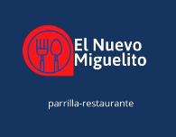

# El nuevo Miguelito.
## Parcial 2023.

**Miguelito tiene una parrilla y nos pidió un sistema para administrar su menú.**

### 1 - Comidas 🍖
De los distintos platos que ofrece la parrilla nos interesa conocer:
- Si es **apto celíaco**.
- Su **valoración**, un número que indica qué tan bueno es el plato.
- Si **es especial**.
- Su **precio** está dada por su valoración por 300, más 1200 si es apto para celíacos y está expresado en una moneda de curso legal de la cual no sabemos su nombre.

Consideraremos estos platos:

#### 🔸 Provoleta.
Cada provoleta tiene un peso diferente y pueden tener o no empanado. Las provoletas son aptas para celíacos si no tienen empanado. Una provoleta es especial cuando su peso es mayor a 250 gramos y además tiene empanado. Su valoración es de 120 unidades si es especial y de 80 en caso contrario.

#### 🔸 Hamburguesas de carne.
Su peso es el del medallón de carne que tiene más el peso de su pan. El medallón de carne no siempre pesa lo mismo entre una hamburguesa y otra. Cada hamburguesa puede hacerse con diferentes panes. Los panes que existen en la parrilla actualmente los siguientes, pero podría haber otros en un futuro, con diferentes valores:

- **industrial** pesa 60 gramos y no es apto celiaco.
- **casero** pesa 100 gramos y tampoco es apto celiaco.
- **de maíz** pesa 30 gramos y es apto celíaco.

Una hamburguesa es apta para celíacos según el pan con que estén hechas. 
La valoración de la hamburguesa se calcula como su `peso / 10`. 
Nuevamente, se considera especial cuando su peso es mayor a 250 gramos.

#### 🔸 Hamburguesas dobles.
También pueden estar hechas con cualquiera de los panes que usa  la parrilla, con todo lo que ello implica, pero en vez de uno tiene dos medallones de carne, siempre del mismo peso. En este caso, se considera especial si su peso es mayor a 500 gramos. Su valoración se calcula como su `peso / 10`.

#### 🔸 Corte de carne.
Puede ser asado, vacío, matambre de cerdo u otros. Puede ser jugoso, a punto o cocido. Su peso no está predeterminado y se considera especial si su peso es mayor a 250 gramos, como los otros platos, y está a punto. Son aptos para celíacos. La valoración es siempre 100.

#### 🔸 Parrillada.
Una parrillada está compuesta por varios cortes de carne, puede tener provoletas o incluso venir con una o más hamburguesas. El peso es la suma de los pesos de todo lo que lo compone, y es especial cuando además de superar los 250 gramos tiene al menos 3 componentes. Si alguna de las cosas que incluye no es apta para celíacos, la parrillada tampoco lo es. Su valoración es la mayor valoración de todo lo que la compone.

___
### 2 - Comensales 👥
De cada comensal se conoce su dinero disponible.
De los comensales que van a la parrilla nos interesa saber si les agrada o no una comida, lo cual dependerá del comensal:

- Celíacos: Les agradan las comidas que son aptas para celíacos.
- De paladar fino: Simplemente les agradan las comidas especiales o que tienen una valoración mayor a 100.
- Todo terreno: Nada le desagrada.

Cuando un comensal se quiere dar un gusto en la parrilla de Miguelito, compra el plato de máxima valoración entre los que ofrece dicha parrilla, le agradan a dicho comensal y que pueda pagar. Si no hay ningún plato que pueda comprar, advertir adecuadamente y con precisión. En caso que lo compre, actualizar su dinero y los ingresos de la parrilla.

La parrilla decide hacer una promoción, y le regala una X cantidad de dinero a todos los comensales que alguna vez hayan comprado un plato en la parrilla.

___
### 3 - Cambios de hábitos 💡
Permitir que sucedan las siguientes situaciones y que todo lo anterior siga funcionando
- A un comensal empieza a tener problemas gástricos y le descubren celiaquía, con lo que modifica sus hábitos de alimentación
- Debido a un cierta decisión económica que toma un gobierno recientemente elegido en algún lugar del mundo, una serie de comensales que se consideraba de paladar fino se ven fuertemente limitados en sus posibilidades económicas y deciden hacerse "todo terreno".
- Inventar algo que provoque que alguien se haga paladar fino.

___
### 4 - Tests 🧪
Realizar al menos los siguientes tests.
- Tener una parrillada con al menos tres componentes y probar los casos significativos.
- Hacer que un comensal se de un gusto en la parrilla, incluyendo al menos un caso donde pueda comprar y otro que no.
- Realizar un cambio de hábito de algún comensal, y que alguna de las situaciones anteriores tenga otro resultado.