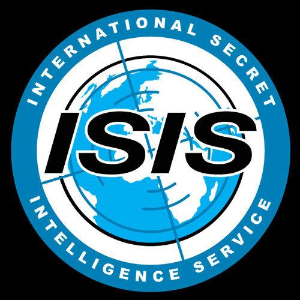

# Danger Zone
## Parcial 2020

En un edificio de Manhattan, disfrazado como una tintorería, existe una agencia de espionaje llamada ISIS (Servicio Internacional de Inteligencia Secreta), que cuenta con los mejores agentes de Estados Unidos. Si bien el servicio de lavandería es bien retribuido, los principales ingresos de la agencia están ligados a la resolución efectiva de misiones.

Todos los empleados poseen habilidades, las cuales usan para resolver misiones, y una cantidad de salud variable. Sabemos que los empleados quedan incapacitados cuando su salud se encuentra por debajo de su salud crítica.

Los distintos empleados que necesitamos representar son o bien espías u oficinistas, los cuales reaccionan de maneras diversas:

Espías: Son los referentes más importantes dentro de la agencia y son capaces de aprender nuevas habilidades al completar misiones.
La salud crítica de los espías es 15.
Oficinistas: de alguna forma u otra siempre terminan involucrándose en las misiones. Sabemos que si un oficinista sobrevive a una misión gana una estrella.
Su salud crítica es de 40 - 5 * la cantidad de estrellas que tenga.
Para resolver una misión, los empleados pueden conformar equipos, para colaborar y mejorar sus chances de éxito.

Además algunos empleados son jefes de otros empleados, y pueden ser asistidos por ellos cuando la misión lo amerite. Los jefes también pueden ser tanto espías como oficinistas.

Se pide:

Saber si un empleado está incapacitado.
Saber si un empleado puede usar una habilidad, que se cumple si no está incapacitado y efectivamente posee la habilidad indicada. En el caso de los jefes, también consideramos que la posee si alguno de sus subordinados la puede usar.
Hacer que un empleado o un equipo cumpla una misión.
Esto sólo puede llevarse a cabo si quien la cumple reúne todas las habilidades requeridas de la misma (si puede usarlas todas). Para los equipos alcanza con que al menos uno de sus integrantes pueda usar cada una de ellas.

Luego, el empleado o el equipo que cumplió la misión recibe daño en base a la peligrosidad de la misión. Para los equipos, esto implica que todos los integrantes reciban un tercio del daño total.

Por último, los empleados que sobreviven al finalizar la misión (por tener salud > 0) registran que la completaron, teniendo en cuenta que:
- Los oficinistas consiguen una estrella. Cuando un oficinista junta tres estrellas adquiere la suficiente experiencia como para empezar a trabajar de espía.
- Los espías aprenden las habilidades de la misión que no poseían.