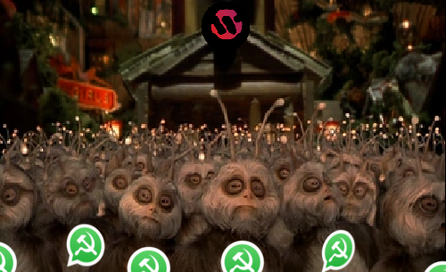

# Servicio de Mensajería Wollokiano.
## Parcial 2020.

En lo más recóndito de la galaxia orientada a Objetos, en una zona plagada de pepitas, se encuentra el planeta Wollok. Sus habitantes desean que implementemos un servicio de mensajería para comunicarse entre ellos y nos dieron ciertos requerimientos para que cumplamos...

### Los mensajes 📧
De los mensajes es importante saber qué usuario lo envió y cuántos KB pesa. El peso de un mensaje siempre se calcula como:

    5 (Datos fijos de transferencia) + Peso del contenido * 1,3 (Factor de la red)

Un mensaje puede tener varios tipos de contenido (cada mensaje tiene uno), describimos algunos de ellos:
- **Texto**: Sirven para enviar texto... es el más usado. Su peso es de 1KB por caracter.
- **Audio**: Su peso depende de la duración del mismo. 1 segundo de audio pesa 1.2 KB.
- **Imagen**: De las imágenes conocemos su alto y ancho, medido en pixeles (entonces la cantidad total de píxeles es ancho x alto). El peso de estos mensajes depende del modo de compresión:
    - Compresión original: no tiene compresión, se envían todos los pixeles.
    - Compresión variable: se elige un porcentaje de compresión distinto para cada imagen que determina la cantidad de pixeles del mensaje original que se van a enviar.
    - Compresión máxima: se envía hasta un máximo de 10.000 píxeles. Si la imagen ocupa menos que eso se envían todos, sino se reduce hasta dicho máximo.
    > También se pueden enviar GIFs, que son como cualquier imagen pero además se conoce la cantidad de cuadros que tiene. El peso de estas imágenes es como una imagen normal de las mismas características multiplicada por la cantidad de cuadros del GIF.
    > En todos los casos (gifs e imágenes) se considera que un pixel pesa 2KB.

- **Contacto**: Sí! Se pueden enviar usuarios como contenido de los mensajes. Se debe saber qué usuario se envía y el peso de estos contenidos es siempre 3 KB.

### Chateando 📱
En nuestro servicio de mensajería, existen chats, y se pueden enviar los mensajes a esos chats. Pero ojo, no se puede enviar un mensaje a cualquier chat. El emisor del mensaje debe estar entre los participantes del chat. Además, los usuarios tienen una memoria que se va llenando con cada mensaje, y al enviar un mensaje a un chat es necesario que cada participante tenga espacio libre suficiente para almacenarlo.

**Chats premium**
Además de los chats clásicos, se pueden tener chats premium para tener otro control sobre el envío de mensajes. Además de las restricciones de los chats clásicos, se agrega una restricción adicional:
- Difusión: Solamente el creador del chat premium puede enviar mensajes.
- Restringido: Determina un límite de mensajes que puede tener el chat, una vez llegada a esa cantidad no deja enviar más mensajes.
- Ahorro: Todos los integrantes pueden enviar solamente mensajes que no superen un peso máximo determinado.

> Tanto esta restricción adicional como los integrantes de un chat premium pueden ser modificados en cualquier momento.

Se pide la codificación completa en Wollok para los siguientes requerimientos. Además, se debe aclarar de alguna forma **el punto de entrada** para cada punto (dónde empieza todo en cada caso):
1. Saber el **espacio que ocupa** un chat, que es la suma de los pesos de los mensajes enviados.
2. **Enviar un mensaje** a un chat considerando los tipos de chats y las restricciones que tienen. 
3. Hacer una **búsqueda de un texto** en los chats de un usuario. La búsqueda obtiene como resultado los chats que tengan algún mensaje con ese texto. Un mensaje contiene un texto si es parte del nombre de quien lo envía, si es parte del texto del mensaje, o del nombre del contacto enviado. [1]
4. Dado un usuario, conocer sus **mensajes más pesados**. Que es el conjunto formado por el mensaje más pesado de cada uno de sus chat.
5. Los usuarios también son notificados de sus chats sin leer. Hacer que:
    - Al enviar un mensaje a un chat cada participante debe **recibir una notificación**.
    - Que un usuario pueda **leer un chat**. Al leer un chat, todas las notificaciones del usuario correspondiente a ese chat se marcan como leídas.
    - Conocer las **notificaciones sin leer** de un usuario.
6. Hacer al menos 3 tests que prueben el funcionamiento de:
    - Un método de consulta.
    - Un método de acción.
    - Un método que falla.

___
> [1] Los strings entienden el mensaje contains(otroTexto) que indica si el parámetro se encuentra dentro del string.
