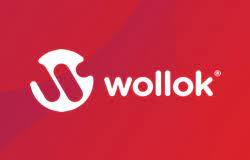

# **WOLLOK**.
___
## ¿Qué es Wollok?
Wollok es un lenguaje de programación y entorno de desarrollo integrado (IDE) para ser utilizado en el dictado de materias iniciales de Programación Orientada a Objetos (POO). Es ideal ya que permite ir agregando los detalles y conceptos de forma incremental y programando desde el primer día.  
Un POO es un conjunto de objetos que se conocen entre sí a través de referencias y que se envían mensajes en un ambiente.

## Conceptos de la materia.
- Abstracción.
- Declaratividad.
- Expresividad.
- Orden Superior.
- Polimorfismo.
- Esquemas de Tipado.
- Declaratividad vs. Expresividad.
- Diferencias entre polimorfismo, abstracción y encapsulamiento.

## Contenido de la carpeta.
En esta carpeta se encuentran algunos parciales resueltos por mi, que fueron realizados con el fin de practicar dicho paradigma y prepararme para su examen. Además, agregué el parcial que se me tomó en 2023 (con mi posible solución) y los TPs que realicé durante todo ese año.

> Para mas detalles sobre el lenguaje visitar:
>   - https://www.wollok.org/
>   - https://wiki.uqbar.org/wiki/articles/paradigmas-de-programacion.html
