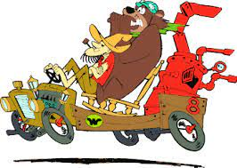

# El Alambique viajero.
## Trabajo Practico.

**A Luke le gusta viajar por el mundo y traerse recuerdos. Suele ir en el "alambique veloz" pero en ocasiones cambia de vehículo**.

Averiguar:
1. ¿Cuantos lugares visito Luke?.
2. El recuerdo que se trajo del último lugar que visito.

Para ello es necesario tener en cuenta:
Cuando viaja, Luke se trae un recuerdo tipico del lugar visitado que conserva en un lugar destacado de su casa. El problema es que su casa es pequenia, por lo que tira el recuerdo que haya traido de algun viaje anterior.
El vehiculo utilizado para viajar sufre las consecuencias del viaje. Por otro lado, sabemos que el Alambique Veloz consume una cierta cantidad de combustible en cada viaje que realiza.
Cuando pretende visitar una ciudad a la que no puede ir, simplemente no va.

### Recuerdos.
Se conocen los siguientes recuerdos
- El recuerdo tipico de **Paris** es un llavero de la torre eiffel.
- **Buenos Aires** tiene como recuerdo tipico un mate, pero dependiendo de quien sea el presidente puede venir o no con yerba.
- El recuerdo tipico de **Bagdad** va cambiando con los anios, en algun momento pudo haber sido un bidon con petroleo crudo, alguna de las armas de destruccion masiva que nunca se encontraron o una replica de los miticos jardines colgantes de Babilonia (O tal vez en el momento que viaje Luke sea otro diferente)
- **Las Vegas**, mas que tener algo tipico propio, hace "homenaje" a otros lugares. Por ejemplo, si es visitada cuando se esta conmemorando a Paris, el recuerdo es tambien el llavero de la torre eiffel y si se estuviera recordando a Buenos Aires, seria el mate.

### Lugares.
Para poder ir a las ciudades, hay diferentes restricciones dependiendo del vehiculo en que se pretenda ir.
- **Paris**: El alambique veloz tiene que tener el tanque de combustible lleno.
- **Buenos Aires**: El vehiculo tiene que ser rapido.
- **Bagdad**: No hay restricciones.
- **Las Vegas**: La misma restriccion del lugar que se este homenajeando.

### Agregar.
- Otros vehiculos que pueda usar Luke para viajar, por ejemplo el super chatarra especial o el espantomovil. (Inventar su comportamiento y su estado interno con creatividad, evitando que tengan tambien un tanque de combustible)
- Tu destino turistico preferido.