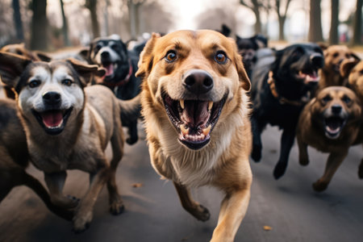

# Criaderos.
## Trabajo Práctico 2022.

Necesitamos modelar la forma en que los criaderos de perros se comportan a la hora de cruzar sus animales con los perros que llevan sus clientes.

Ya tenemos representados a los perros, para los cuales registramos su velocidad, su fuerza, si es adulto y si esHembra. Además nos interesa conocer su status que es la suma entre la fuerza y velocidad, como puede verse en el código inicial.

Sabemos que los criaderos pueden cruzar perros en base a estilos de cruza diversos, lo cual impacta, entre otras cosas, en las características que tendrá la cría de ambos perros en caso de que la cruza sea exitosa.



___
### Parte 1: Estilos de cruza 🧬
Sabemos que hay diferentes resultados para la cruza entre 2 perros dependiendo del estilo de cruza que se use. A su vez pueden diferir las precondiciones para que la cruza en cuestion sea exitosa.

Decimos que la cruza es exitosa si los 2 perros cumplen con los requisitos para cruzarse de acuerdo a ese estilo de cruza que se explican mas adelante, y como resultado se obtiene la cria: un perro joven cuya velocidad y fuerza derivan de la velocidad y fuerza de los padres.

> 💡 El sexo de la cría no es determinístico, hay un 50% de chances de que nazca hembra o macho independientemente del estilo de cruza que se use. Esto ya está resuelto en la inicialización por defecto del atributo booleano `esHembra`.

Respecto a los requisitos, para cualquier estilo de cruza debe cumplirse que los perros a cruzar sean compatibles: ambos deben ser adultos y tener sexos opuestos.

A continuación se detallan cuáles son los distintos estilos de cruza a representar, con sus particularidades:
- `cruzaPareja`: La cría resultante de la cruza debería ser un perro cuyos valores para velocidad y fuerza equivalgan a la suma de los valores correspondientes de sus padres dividido 2. Por ejemplo, si la madre tiene velocidad 8 y el padre tiene velocidad 6, la cría tendrá velocidad 7.

- `underdog`: La cría resultante de la cruza debería ser un perro cuyos valores para velocidad y fuerza equivalgan al mínimo valor correspondiente de sus padres, multiplicado por 2. Por ejemplo, si la madre tiene velocidad 8 y el padre tiene velocidad 5, la cría tendrá velocidad 10.

- `hembraDominante`: La cría resultante de la cruza debería ser un perro cuyos valores para velocidad y fuerza equivalgan al valor correspondiente de la madre sumado al 5% del valor correspondiente del padre. Por ejemplo, si la madre tiene velocidad 8 y el padre tiene velocidad 10, la cría tendrá velocidad 8.5.

Además, para este estilo de cruza en particular, no alcanza con que los perros sean compatibles. Es necesario también que **la fuerza de la hembra supere a la fuerza del macho** para que la cruza sea exitosa.

Para resolver este requerimiento se espera que todos los estilos de cruza entiendan el mensaje: `cruzar(perro1, perro2)`.


> Tener en cuenta que:
> 
> - No debería importar el orden en el que se parametricen el macho y la hembra al estilo de cruza, el resultado debería ser equivalente.
> - Determinar cuál es el comportamiento esperado cuando la cruza no es exitosa forma parte de los objetivos de este trabajo 😉

___
### Pruebas automáticas 🧪
Para que el ejercicio este completo, mas alla de implementar lo pedido, se debe pasar los tests unitarios.

Tener en cuenta que deben completarse los siguientes tests acorde a las decisiones que hayas tomado para resolver lo pedido para los estilos de cruza:
- La cruza basada en hembra dominante de perros adultos con hembra débil no es exitosa.
- La cruza de dos machos no es exitosa para cualquier estilo de cruza.
- La cruza de dos hembras no es exitosa para cualquier estilo de cruza.
- La cruza de dos perros no es exitosa si alguno no es adulto para cualquier estilo de cruza.

> 💡 Para los últimos escenarios que deberían validarse para todos los estilos de cruza, se propone usar el siguiente método auxiliar que ya se encuentra definido para simplificar la tarea:
> ```
> method paraTodoEstiloDeCruzaSeVerificaQue(bloqueConAsercion) {
>   #{cruzaPareja, hembraDominante, underdog}.forEach(bloqueConAsercion)
> }
> ```
> De esa forma alcanza con que pienses cuál es la validación que harías para cualquiera de esos objetos guiándote por la explicación de cada test a completar.

___
### Parte 2: Cruzas en el criadero 🐶
Como se explicó anteriormente, queremos poder cruzar un perro con alguno de los múltiples perros que tenga el criadero. Para resolver este requerimiento se espera que los criaderos entiendan el mensaje `cruzar(estiloDeCruza, perroACruzar)` y que, en caso de que pueda cruzar exitosamente al perro recibido basándose en ese estilo de cruza indicado, retorne a la cría obtenida.

El proceso para realizar la cruza en el criadero no es trivial y podría fallar por motivos diversos. A continuación se detalla el comportamiento esperado:

En primer lugar, necesitamos asegurar que el criadero sólo intente cruzar perros que sean **compatibles** (por tener distinto sexo y ser adultos como se explicó anteriormente). Por ese motivo, como punto de partida sólo se considerarán como **potenciales parejas** a los perros del criadero que sean compatibles con el que se solicitó cruzar.

Luego, con esas potenciales parejas, el criadero tendrá **3 intentos para cruzar** al perro en cuestión con distintas potenciales parejas, por lo que se tratará de beneficiar a los perros de más status probando primero con el de mayor status, luego con el que le sigue, y así.

En caso de que los primeros 3 intentos de cruza no sean exitosos, se espera que la operación del criadero falle con una excepción de tipo `IntentosDeCruzaAgotadosException`.

Si no se llega a conseguir una cría probando hasta 3 cruzas a raíz de no tener suficientes parejas potenciales para el perro solicitado, la operación debería fallar con una excepción del tipo `NecesitaMasPerrosException`.

> **Ejemplos**
> Para ilustrar mejor los distintos escenarios a grandes razgos, se plantea la siguiente situación:
> - Dado un criadero que tiene los siguientes perros:
>     - Un macho adulto con velocidad 15 y fuerza 10 (status: 25)
>     - Una hembra adulta con velocidad 5 y fuerza 10 (status: 15)
>     - Una hembra adulta con velocidad 15 y fuerza 7 (status: 22)
>     - Otras 2 hembras adultas que tienen menor status y fuerza que las anteriores
>     - Varios machos y hembras jovenes, con status mayor a 30.
>
> - Por otro lado tenemos a los siguientes perros que podríamos querer cruzar en el criadero:
>     - **Bobby**: Un macho adulto con velocidad 3 y fuerza 9.
>     - **Trancos**: Un macho adulto con velocidad 15 y fuerza 20.
>     - **Nina**: Una hembra adulta con velocidad 10 y fuerza 5
>     - **Pip**: Un macho joven con velocidad 10 y fuerza 17.

1. Si se quisiera cruzar con un estilo de **cruza pareja** a Bobby, la cruza sería exitosa obteniendo una cría con velocidad 9 y fuerza 8, ya que debería elegirse como pareja a la hembra adulta de status 22.

2. Si se intentara la misma cruza pero con un estilo **hembra dominante**, se trataría de cruzar a Bobby primero con la hembra de status 22, pero al no ser más fuerte la hembra que el macho ese primer intento no sería exitoso. Sin embargo al probar con la segunda pareja posible, la hembra de status 15, sí se podría realizar la cruza obteniendo como resultado la cría con velocidad y fuerza similares a los de la madre.

3. Si se intentara cruzar a Trancos con un estilo **hembra dominante** no se podría cruzar exitosamente: fallaría por intentar cruzar a Trancos más de 3 veces sin lograr obtener una cría con las hembras que dispone.

4. Si se intentara cruzar a Nina con un estilo de **hembra dominante** no se podría cruzar exitosamente: fallaría por no tener suficientes machos adultos luego de fallar en su primer intento.

5. Si se intentara cruzar a Pip con un estilo de cruza pareja no se podría cruzar exitosamente, porque Pip no es adulto, con lo cual no habrán potenciales parejas con las cuales intentar cruzarlo.

___
### Pruebas automáticas 🧪
Para que el ejercicio esté completo deben pasar los tests unitarios.