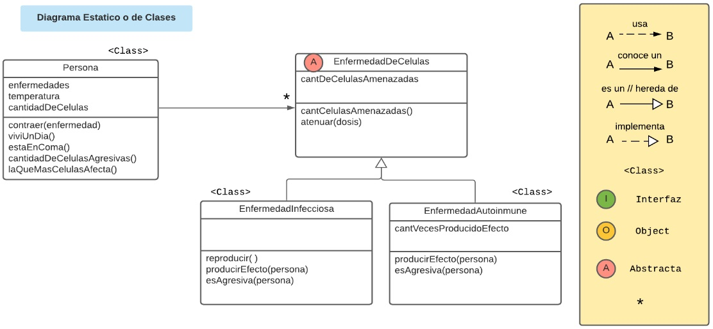
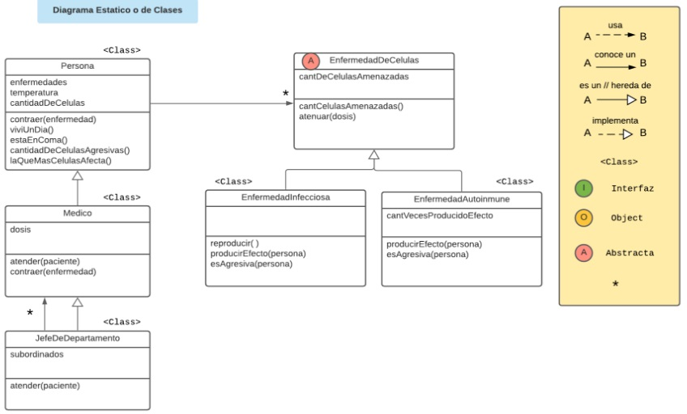
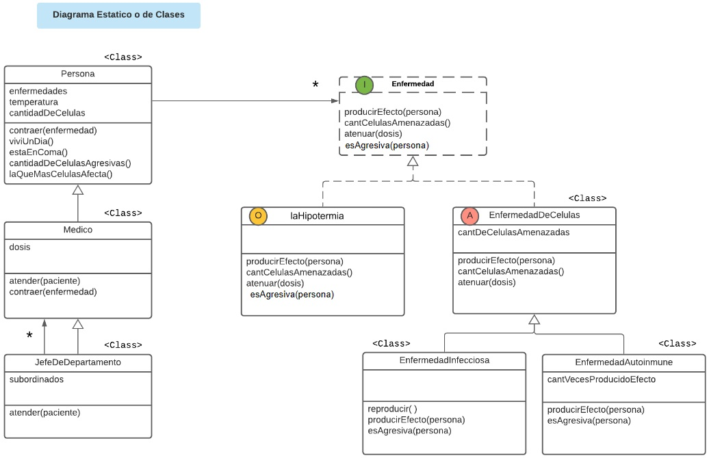

# Hospital Universitario Tecnologico.
## Trabajo Practico.

El Departamento de Diagnostico del Hospital Universitario Tecnologico nos pidio que les dieramos una mano con un sistema que les ayude a hacer su trabajo. Despues de una interconsulta con distintos docentes de la materia optamos por modelarlo en objetos y llegamos a esta solucion hasta ahora...

### PARTE 1. Enfermedades.
La directora del hospital nos llamo para actualizarnos sobre los requerimientos. 
Los medicos saben atender a cualquier persona enferma dandoles una dosis de medicamento propia de cada medico. Cuando la persona recibe un medicamento las enfermedades que tiene en el cuerpo se atenuan (Cada una se atenua en la cantidad de medicamento recibida, multiplicada por 15), y se curan en el caso de que no afecten a mas celulas. 
1. Hacer que cualquier enfermedad pueda atenuarse.
> Por ejemplo que la malaria se atenue en 100 celulas y el lupus en 500 celulas.

2. Hacer que las enfermedades puedan resistirse al tratamiento
   - Al atenuarse, en los casos de las enfermedades infecciosas, en lugar de tomar recibir la dosis entera estas se resisten en 20 ml.
   - Las enfermedades autoinmunes no tienen resistencia.
   - Otras enfermedades podrian tener diferente resistencia.

### PARTE 2. Medicos y Jefes de departamento.
1. Hacer que un medico atienda a una persona.
> Por ejemplo que Cameron, una doctora que administra dosis de 100 ml, atienda a Logan.

2. Existen medicos que son jefes de departamento. Cuando tienen que atender a un paciente, no le administran medicacion, sino que les dicen a uno sus subordinados que lo haga.
> Por ejemplo hacer que Cuddy atienda a Cameron (Si, los medicos son personas y pueden enfermarse)

3. Hacer que cuando un medico contraiga una enfermedad, este trate de curarse atendiendose a si mismo.
> Por ejemplo, hacer que Cameron contraiga malaria, hacer que Cuddy contraiga malaria, y pensar en el method lookup en ambos casos.

### PARTE 3. Hipotermia.
Agregar la **hipotermia** y probarla haciendo que Cuddy contraiga la hipotermia. La hipotermia actua disminuyendo toda la temperatura de la persona y no se atenua con ningun medicamento. No afecta ninguna celula (no tiene sentido, ya que afecta a la persona entera) y es extremadamente agresiva.

### PARTE 4. Especialidades.
Agregar especialidades a los medicos. Segun la especialidad, se hace un tratamiento extra al atender:
- **Enfermero**: Da otra dosis de medicamento, a 10 unidades.
- **De guardia**: Estabiliza la temperatura, dejandola en 36°C.
- **Sin especialidad**.

Los medicos pueden cambiar de especialidad, ademas podrian haber mas especialidades en el futuro.