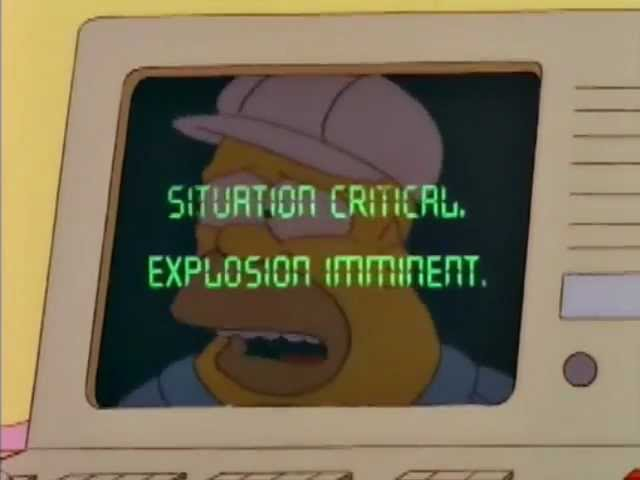

# Peligro por Distraccion.
## Trabajo Práctico 2023.

La planta nuclear de Springfield puede estar en peligro. Para ello vamos a modelar con el **paradigma de objetos** algunas partes que nos interesan:

___
Se pide la codificación de la solución en Wollok para:

1. Homero puede tener una cantidad de donas, al principio no tiene ninguna. 
    - Hacer que Homero compre y coma donas. Cuando Homero compra donas, lo hace por docena, mientras que cuando las come lo hace de a una.
    - Hacer tests que prueben que lo de arriba funciona correctamente. (Si funciona, commit!)
2. Homero se distrae cuando tiene pocas donas (Menos de 2). 
    - Poder saber si Homero está distraído.
    - ¡Tests!
        - Homero con pocas donas está distraído.
        - Homero con muchas donas no está distraído.
3. La planta nuclear de Springfield tiene un encargado de la sala de control y barras de uranio (podemos suponer que al principio no hay barras). 
    - El objetivo principal es averiguar si la planta está en peligro. Esto sucede cuando el número de barras de uranio que hay en el depósito es mayor a 10000 y el encargado de la sala de control está distraído.
    - Periódicamente, llegan a la planta de energía cargamentos con cierta cantidad de barras de uranio. Poder hacer que llegue un cargamento con una cantidad determinada de barras.
    - Tests:
        - La planta nuclear con pocas barras no está en peligro.
        - La planta nuclear con muchas barras y un encargado distraído está en peligro.
4. Homero debe poder ser reemplazado en la sala de control por el pato balancín, que nunca se distrae.
5. También Lenny debe poder ser encargado. Lenny toma cerveza mientras trabaja, y se distrae después de haber tomado más de 3. (Hacer los tests para Lenny)
6. Además, tenemos a Mr. Burns, que inicialmente es millonario, pero se puede despojar de sus riquezas y volverse pobre. 
    - Se pide poder saber si Mr. Burns es pobre. 
    - Poder despojar de sus riquezas a Mr. Burns.
    - Cambiar la lógica para saber si la planta está en peligro: también puede estar en peligro si Mr. Burns se quedó pobre.
    - A los tests para saber si una planta está en peligro hay que agregar los casos de cuando Mr. Burns está pobre y cuando no.
