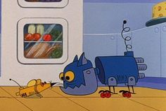

# Tom y Jerry.
## Trabajo Practico.

Queremos modelar el paso de los dias y de las noches en la **casa de Tom y Jerry**. La casa siempre tiene un cuidador y a veces tiene a un quilombero. Ademas tiene un cierto nivel numerico de suciedad.

Se pide la codificacion de la solucion en Wollok para:

### Dias y Noches.
1. Cuando pasa el dia en la casa el cuidador limpia la casa y luego intenta sacar al quilombero de la casa, lo cual ocurre solo si puede atraparlo.
2. Cuando pasa la noche en la casa el cuidador duerme y el quilombero hace quilombo.

### Cuidadores y Quilomberos.
3. **Tom**: Tiene una cierta cantidad de energía variable. Al limpiar la casa reduce la suciedad en 100 y pierde 40 de energía. Su velocidad es 5 + (la energía de tom / 10). Puede atrapar a un quilombero si es más rápido que él. Al dormir incrementa su energía en 50.
4. **Jerry**: Tiene un cierto peso variable. Cuando hace quilombo ensucia la casa en 110 y también se roba comida, por lo que aumenta en 1 su peso. Su velocidad es 10 - el peso de jerry.
5. **Tuffy**: Su velocidad es siempre 10 y al hacer quilombo hace mucho ruido en la casa, por lo que interrumpe el sueño del cuidador de la casa. Cuando Tom tiene su sueño interrumpido pierde 20 de energia.
6. **Robocat**: Al limpiar la casa la deja totalmente limpia, osea con suciedad 0. Como es un robot muy avanzado siempre puede atrapar a cualquier quilombero. Al “dormir” simplemente se apaga, por lo que no puede tener su sueño interrumpido.

### Nuevos requerimientos.
7. Codificar un **nuevo** cuidador y quilombero que puedan estar en la casa.
8. Escribir los **tests** necesarios para probar el correcto funcionamiento del código.
9. ¿Cuáles son las interfaces que hay en la solución?
