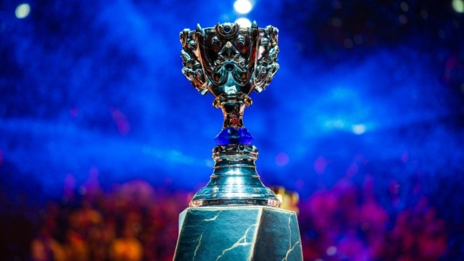

# Wollok Game Worlds.
## Trabajo Practico.

Este mes, la cátedra de los jueves a la mañana, comenzó a llamar la atención por todo el mundo. Estudiantes de PdepJM crearon juegos tan copados que varias organizaciones exigieron la creación de un Mundial de Juegos de Wollok, en donde se podrán presentar los y las mejores jugadoras del mundo, participando en varias etapas hasta llegar a la final por el gran premio. Nos pidieron entonces armar un sistema para organizarlo.

### Parte 1. Jugadores.
Queremos preguntar a diferentes jugadores/as si pueden jugar en el campeonato. 
- En primer lugar está **Caps**, también conocido como Claps o Craps, dependiendo de su rendimiento. 
    De él sabemos que:
    - Tiene 8 años de antigüedad, es decir qué hace 8 años está activo como jugador profesional de esports.
    - Tiene un cansancio que inicialmente es de 50 (debido a las scrims) pero se puede ir modificando luego. 
    
    Nos interesa:
    - Saber si puede jugar: para poder jugar debe ser titular (antigüedad mayor a 3 años) y no estar totalmente cansado (cansancio mayor o igual que 100).
    - Que tome una bebida energizante (lo que hace bajar su cansancio 10 unidades, nunca puede ser menor que 0)

- También tenemos a **Faker**, oriundo de Corea del Sur, que es una de las personas con más copas mundiales.
    - Lo que sabemos hasta ahora es que suele tiltearse mucho.
    - Vamos a querer poder consultar si está tilteado, y poder hacer que se tome un tecito para dejar de estarlo.
    - Faker puede jugar si no está tilteado.

- Por último tenemos a **Josedeodo**, el actual Jungla de Estral Esports. De él sabemos que:
    - Tiene 6 años de antigüedad, es decir que hace 6 años está activo como jugador profesional de esports.
    - También comienza con 50 de cansancio y puede beber bebidas energizantes.
    - Nos interesa preguntarle lo mismo que a Caps y sabemos que tiene en cuenta las mismas consideraciones para responder.

### PARTE 2. Partidas.
Dado que esto es una competencia, vamos a tener **partidas**, en donde dos participantes (que se van a identificar como azul y rojo) van a poder enfrentarse. De una partida nos interesa que comience, y luego, poder saber en otro momento quién gana.
- Al comenzar, cada participante juega, primero el rojo y luego el azul. Cuando un **jugador normal** juega, este aumentará su cansancio en 20; en cambio si el participante es Faker, al jugar aumentará en 30 su habilidad (sí, Faker tiene una habilidad variable).
- La partida la ganará quien tenga mayor habilidad. Para un **jugador normal**, la habilidad está dada por su antigüedad multiplicada por 2 menos su nivel de cansancio. 
Para Faker en cambio, su habilidad será 0 si está tilteado, si no lo está retornará la habilidad que tenga acumulada.

### PARTE 3. EQUIPOS.
¡Aparece un nuevo tipo de participante para las partidas! En vez de competir individualmente, hay participantes que decidieron unirse en equipos para poder tener mayores chances de ganar. De un equipo sabemos que:
- Estará conformado por cierta cantidad de jugadores, y se podrá hacer cambios de estos; es decir que se podrá agregar o quitar.
- Cuando un equipo juega, solamente lo harán aquellos jugadores que estén disponibles para hacerlo, es decir solo aquellos que pueden jugar.
- La habilidad de un equipo estará dada por la suma de las habilidades de todos sus jugadores (estén o no disponibles).